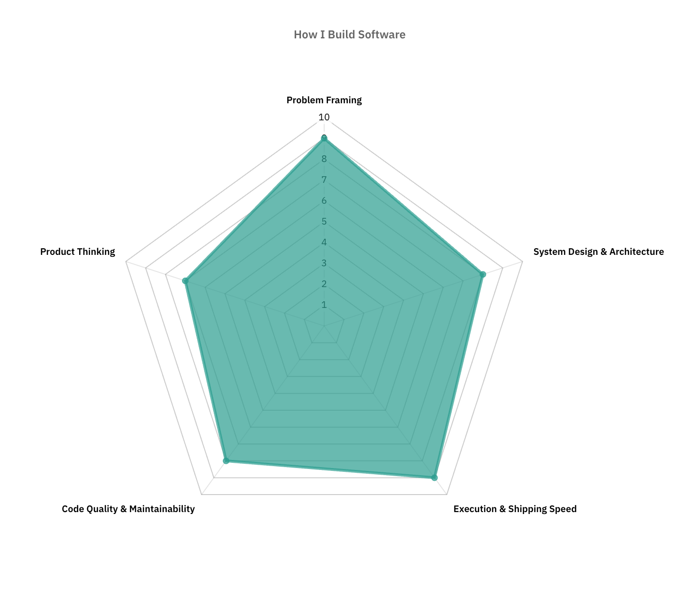

  

###

<h1 align="center">hello there 👋</h1>

###

<h3 align="left">🫡  About Me</h3>

###

Software Engineer  I have over 5 years of experience in tech, I’ve mainly focused on building user-centered product features and collaborating across teams to architect great user experiences.

###

<h3 align="left">🛠 Languages and tools I like to use</h3>

###

  
  
  
  
  
  
  
  
  
  
  
  
  
  
  
  
  
  
  
  
  
  
  
  
  
  
  
  
  
  
  
  
  
  
  
  
  

###

<h3 align="left">🔥   My Stats :</h3>

###

  

###

  

###
